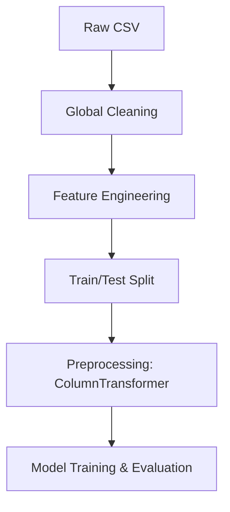

# 🦠 Multi-Resistance Antibiotic Susceptibility — Supervised Learning Final Project


## Contributors

- Côme Bonneviale
- Ange Lavialle

---

## Business Challenge

Antibiotic resistance is a major public health issue. Predicting whether a new bacterial strain will be multi-drug resistant (MDR) helps clinicians anticipate treatments, limit spread, and improve patient care.  
This project aims to build a machine learning model to predict MDR status from clinical and biological data.

**Target Calculation:**
The target variable is_MDR was engineered according to clinical guidelines. A strain is considered MDR if it is resistant to at least one antibiotic in three or more distinct antibiotic families.

The antibiotic families and their corresponding columns in the cleaned dataset are:

- beta_lactams
  - `amx/amp` → Amoxicillin / Ampicillin (aminopenicillins)
  - `amc` → Amoxicillin + Clavulanic Acid (β-lactam/β-lactamase inhibitor)
  - `cz` → Cefazolin (first-generation cephalosporin)
  - `fox` → Cefoxitin (second-generation cephamycin)
  - `ctx/cro` → Cefotaxime / Ceftriaxone (third-generation cephalosporins)
  - `ipm` → Imipenem (a carbapenem, considered a last-resort treatment)
- aminosides
  - `gen` → Gentamicin
  - `an` → Amikacin (broader spectrum, often effective against gentamicin-resistant strains)
- quinolones
  - `acide_nalidixique` → Nalidixic Acid (first-generation quinolone, Gram-negative coverage)
  - `ofx` → Ofloxacin (fluoroquinolone, broad spectrum)
  - `cip` → Ciprofloxacin (fluoroquinolone, widely used for urinary tract infections)
- phenicols
  - `c` → Chloramphenicol (broad-spectrum, rarely used due to toxicity but still tested)
- nitrofuranes
  - `furanes` → Nitrofurantoin (commonly used for urinary tract infections)
- sulfamides
  - `co-trimoxazole` → Combination of Trimethoprim + Sulfamethoxazole (folate pathway inhibitor)
- polymyxins
  - `colistine` → Colistin (polymyxin class, last-line therapy for carbapenem-resistant organisms)

---

## Dataset

- **Source:** `data/Bacteria_dataset_Multiresictance.csv` from [Kaggle](https://www.kaggle.com/datasets/adilimadeddinehosni/multi-resistance-antibiotic-susceptibility)
- **Rows:** 10,710
- **Columns:** 27
- **Features:** Patient info (age, gender, comorbidities), strain info (name, code, collection date), resistance to antibiotics.
- **Target:** `is_MDR` (computed from resistance columns using business rules).

---

## Project Architecture

```
supervised-learning-final-project/
│
├── data/
│   └── Bacteria_dataset_Multiresictance.csv
│   └── cleaned_bacteria_datset.csv         # Cleaned dataset for EDA
├── main.py                                 # Main pipeline and training script
├── utils.py                                # Data cleaning and feature engineering functions
├── requirements.txt                        # Python dependencies
├── README.md
├── eda.ipynb                               # Exploratory Data Analysis notebook
└── assets/
    └── bacteria_banner.jpg
```

---

## Pipeline Overview

### Data Preparation & Feature Engineering



### Sklearn Pipeline Diagram

You can visualize the pipeline structure in code using:

```python
from sklearn import set_config
set_config(display="diagram")
cleaning_engineering_pipeline
```

Or for the full model pipeline:

```python
set_config(display="diagram")
RandomForest
```

---

## Reproducibility Instructions

1. **Copy the dataset:**  
   Place `Bacteria_dataset_Multiresictance.csv` in the `data/` folder.

2. **Python version:**  
   Use **Python 3.10** (recommended).

3. **Install dependencies:**

   ```sh
   python -m venv venv
   venv\Scripts\activate
   pip install -r requirements.txt
   ```

4. **Run the training pipeline:**
   ```sh
   python main.py
   ```

---

## Baseline

- **Features:** Age, gender, infection frequency, comorbidities (diabetes, hypertension, prior hospitalization), strain.
- **Pre-processing:** Column cleaning, missing value handling, OneHot encoding for categoricals, scaling for numericals, imputation.
- **Model:** RandomForestClassifier (`class_weight='balanced'`), no hyperparameter optimization.
- **Metric:** F1-score (stratified 5-fold CV).
- **Score:** _[Fill in your baseline score, e.g. F1 = 0.72 ± 0.03]_

---

## Experiment Tracking

- **Hyperparameter optimization:** Used Hyperopt for CatBoost, XGBoost, HistGradientBoosting, and stacking.
- **Stacking:** Combined multiple models with RandomForest as meta-model.
- **Feature engineering:** Added resistance-based features.
- **Impact:** _[Fill in score improvements, e.g. stacking F1 = 0.76 ± 0.02]_

---

## Next Steps

- Add final scores, feature choices, and detailed experiment impacts.
- Add full contributor names.
- Insert pipeline diagrams and suggestive images for visual enhancement.
